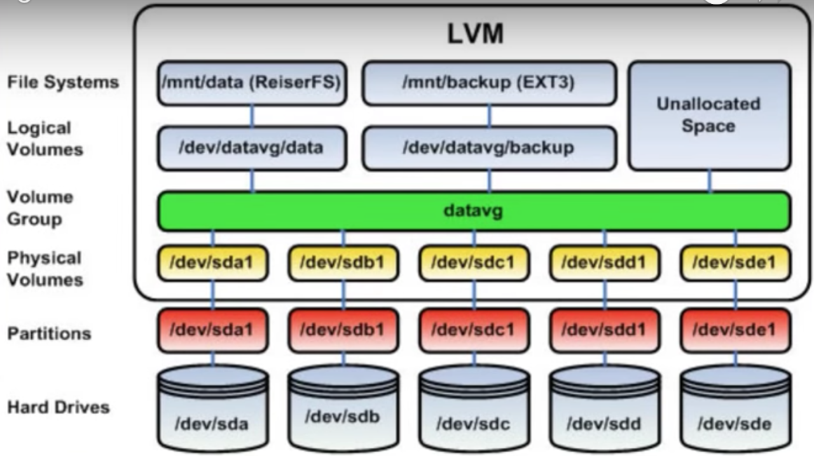

<!--  -->


## Check if using LVM
```bash
cat /etc/fstab
```
>>> `/dev/vg0/lv_root`        /       ext4    rw,relatime 0 1  
>>> UUID=5d8ed2fd-1d33-4a7a-b948-89f1073874f6       /boot   ext4    rw,relatime 0 2  
>>> `/dev/vg0/lv_swap`        swap    swap    defaults        0 0  
>>> /dev/cdrom      /media/cdrom    iso9660 noauto,ro 0 0  
>>> /dev/usbdisk    /media/usb      vfat    noauto  0 0  
>>> tmpfs   /tmp    tmpfs   nosuid,nodev    0       0  

Above highlighted text gives indication.


## Commands


```bash
# Get all lvm commands list
lvm

# Display information about a logical volume
lvdisplay
# Display volume group information
vgdisplay
#Display various attributes of physical volume(s)
pvdisplay
```


