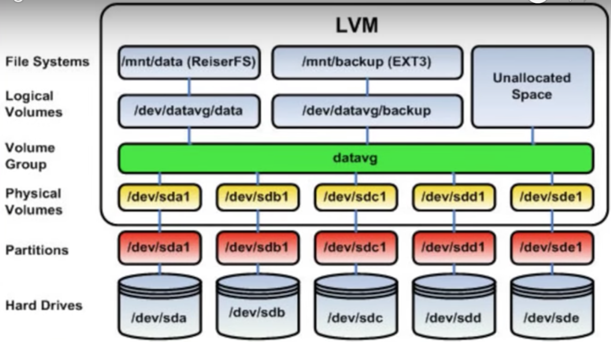

``` mermaid
block-beta
  columns 5
  blockArrowId0<["File Systems"]>(right)
  fs1["/root"]:1
  fs2["/swap"]:1
  fs3["/home"]:1
  fs4[" "]:1
  
  blockArrowId1<["Logical Volumns"]>(right)
  lv1["/dev/vg0/lv_root"]:1
  lv2["/dev/vg0/lv_swap"]:1
  lv3["/dev/vg0/lv_home"]:1
  lv4["Free"]:1


  blockArrowId2<["Volumn Group"]>(right):1
  vg1["VG"]:2
  vg2["VG"]:2

  
  blockArrowId3<["Physical Volumns"]>(right)
  block:pv1:2
    p1[("/dev/sda1")] p2[("/dev/sda2")]
  end  
  block:pv2:2
    p3[("/dev/sdb1")]    
  end

  
  blockArrowId4<["Partitions"]>(right)
  block:diskpart1:2
    dp1[("/dev/sda1")] dp2[("/dev/sda2")]
  end

  block:diskpart2:2
    dp3[("/dev/sdb1")]    
  end

  blockArrowId5<["Hard Drives"]>(right)
  block:disk:4
    d1[("/dev/sda")] d2[("/dev/sdb")]
  end

  classDef disk fill:#000,stroke:#666,stroke-width:4px
  class d1,d2 disk

  classDef diskpart fill:#735400,stroke:#333,stroke-width:4px
  class dp1,dp2,dp3 diskpart
  
  classDef lvs fill:#bbf,stroke:#f66,stroke-width:2px,color:#fff,stroke-dasharray: 5 5
  class lv1,lv2,lv3 lvs
```

<!--  -->

<!-- https://mermaid.live/edit#pako:eNqNlG1r2zAUhf-KUL-04DS2_JJEjMEgtBtsMCj0w-oyFEt-IbJlJMVJVvLfK9mJZ2dJGcFgnXt1ziMH3TeYCMoghisukvVkxTSJKwASwTdlpUBoF23pi5Ri-426n15i-FBwBp72SrNSxfD1860sslzf2d5UeaZhKoXQpoK9TkNWU1tSDzTfarko2UALjAb69Xm2Z7O_i6xICAfPHeFZPG_aeMqaaZO5U978HpHwBp2VR1C88c_KIz7eWL4HyU6S_Y0RkUXs0MCjFJt6wNeZNJklfH60FqgT0FC4dHDfuv7M9-qDk7f9uG68zhWA2nu5PR5GUeLF8O4V1GioIavZZlbRQagxQb2JP9iw6kxA12s2XaYNWloidaELcYWTFmpdm5aell7Cpdd5B5--N0N_zf4De4gcWuSvRFKwlEXDrjPj4Jgwou1gh6yrf1ATTpRashRYG5AWnOMb13UdpaVYM3wTRdHxfbItqM5xUO_6fSbPoajdesHNnv3oOPPDYGDq-_5HprVxrZF5_N7n9If2AbxRR-_VKu2N03NaVO8cMzSENLX01DehROVESrLHIOxmSZdsrqlj7qJ5fBsAHVgyWZKCmkH01iJAnTN79bB5pUSuYxhXB9NHNlo87asEYi03zIHmjmU5xCnhyqw2NSWaLQuSSVL2ak2qX0KM1hC_wR3EyPPvUYgWs_kichdB4M0duId4Mg_vXS9yZy4KQ3e-cKODA_-0Fp4DGS20kD-6sdlOz8M7Q0uw6w -->

<!-- [](https://mermaid.live/edit#pako:eNqNlG1r2zAUhf-KUL-04DS2_JJEjMEgtBtsMCj0w-oyFEt-IbJlJMVJVvLfK9mJZ2dJGcFgnXt1ziMH3TeYCMoghisukvVkxTSJKwASwTdlpUBoF23pi5Ri-426n15i-FBwBp72SrNSxfD1860sslzf2d5UeaZhKoXQpoK9TkNWU1tSDzTfarko2UALjAb69Xm2Z7O_i6xICAfPHeFZPG_aeMqaaZO5U978HpHwBp2VR1C88c_KIz7eWL4HyU6S_Y0RkUXs0MCjFJt6wNeZNJklfH60FqgT0FC4dHDfuv7M9-qDk7f9uG68zhWA2nu5PR5GUeLF8O4V1GioIavZZlbRQagxQb2JP9iw6kxA12s2XaYNWloidaELcYWTFmpdm5aell7Cpdd5B5--N0N_zf4De4gcWuSvRFKwlEXDrjPj4Jgwou1gh6yrf1ATTpRashRYG5AWnOMb13UdpaVYM3wTRdHxfbItqM5xUO_6fSbPoajdesHNnv3oOPPDYGDq-_5HprVxrZF5_N7n9If2AbxRR-_VKu2N03NaVO8cMzSENLX01DehROVESrLHIOxmSZdsrqlj7qJ5fBsAHVgyWZKCmkH01iJAnTN79bB5pUSuYxhXB9NHNlo87asEYi03zIHmjmU5xCnhyqw2NSWaLQuSSVL2ak2qX0KM1hC_wR3EyPPvUYgWs_kichdB4M0duId4Mg_vXS9yZy4KQ3e-cKODA_-0Fp4DGS20kD-6sdlOz8M7Q0uw6w) -->
